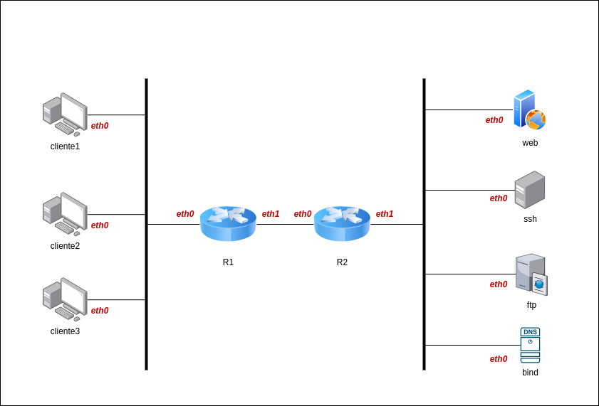

# Laboratório de redes para a disciplina inf534 usando docker

Topologia mais elaborada, com 3 containers cliente, 2 roteadores e 4 servidores (1 servidor web (nginx), 1 servidor ftp, 1 servidor ssh e 1 servidor de dns (bind))

## Diagrama da rede
* O diagrama da rede apresentado a seguir foi gerado pelo programa "draw.io" (https://app.diagrams.net/). O arquivo utilizado foi o diagrama.drawio 

## Plano de endereçamento

## Clientes
* cliente1, cliente2 e cliente3
* utilizam a imagem debian-cliente (debian buster com alguns pacotes como traceroute, tcpdump, netcat, curl, links, nmap, ftp)

## Roteadores
* R1 e R2
* Utilizado o software frr (https://frrouting.org/)
  * utilizando rip e ripng (bem simples)
  * Arquivo de configuracao: /etc/frr/frr.conf
  * Comando de linha para configuração: vtysh
  * documentação para usuário: http://docs.frrouting.org/en/latest/

## Servidores
* web (nginx), ftp, ssh e dns.
* para o ssh, temos usuario inf500 com senha inf500
* o ftp aceita login anonimo (usuario ftp sem senha)
* o servidor de dns (bind) utiliza a imagem alpine-bind 
